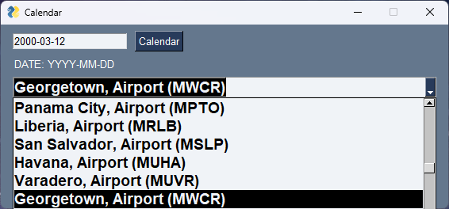
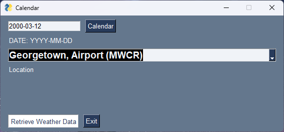
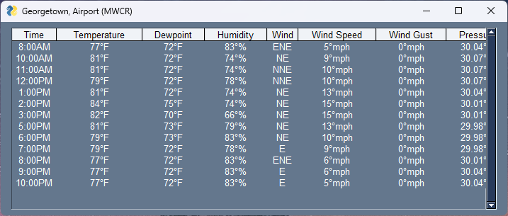
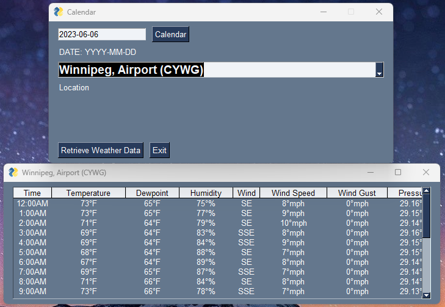
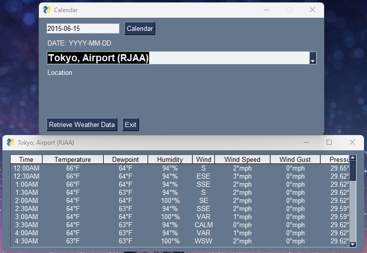

## Assignment 7

### Use BeautifulSoup and PySimpleGUI to scrape data from the web and display it

#### 1. Enter date with YYYY-MM-DD format or select from built in calendar.

#### 2. Select Location using dropdown menu

#### 3. Click "Retrieve Weather Data" button to display weather data in a table

## * More queries

|   #   | File                                 | Description                                |
| :---: | ------------------------------------ | ------------------------------------------ |
|   1   | [main.py](main.py)                   | [Implementation](main.py)                  |
|   2   | [calendarform.png](calendarform.png) | [Calendar Form](calendarform.png)          |
|   3   | [localselect.png](localselect.png)   | [Location Selection Menu](localselect.png) |
|   4   | [compform.png](compform.png)         | [Completed Form](compform.png)             |
|   5   | [weatherdata.png](weatherdata.png)   | [Weather Table](weatherdata.png)           |
|   6   | [winnipeg.png](winnipeg.png)         | [Winnipeg Query](winnipeg.png)             |
|   7   | [tokyo.png](tokyo.png)               | [Tokyo Query](tokyo.png)                   |

